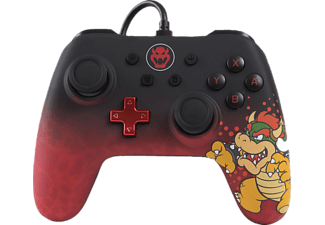
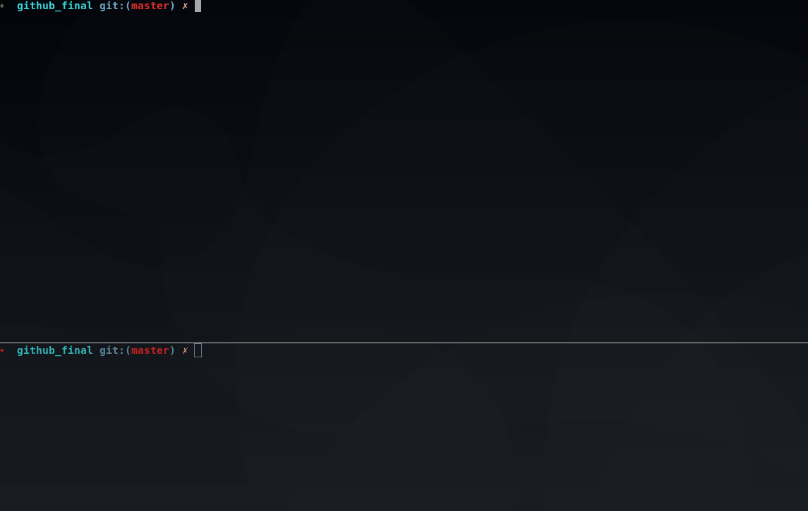

# Linux driver for Nintendo Switch controller
Reverse the controller packets and dive into the joystick/evdev API.

## Description
<br/>
Here is the beast, the USB controller i use to play with on my Nintendo Switch.
I believe PowerA is the manufacturer of this kind of controller.

## User API
I provided a user-space API (controller.c/controller.h) in addition to the kernel-space driver (driver.c)<br/>
Those functions i believe are explicit enough:<br/>
`new_controller_server(void *callback_function);`<br/>
`stop_controller_server(pthread_t thread_id);`<br/>
Once started, a controller server will receive data from the joystick API and send it back to your handler function.<br/>
Your handler function must be ready to receive data under this form:
```
struct js_event {
	__u32 time;     		* event timestamp in milliseconds *
	__s16 value;    		* value *
	__u8 type;      		* event type *
	__u8 number;    		* axis/button number *
};
```
Here is an example of a callback function:
```
static void	handle_event(t_controller controller)
{
	if (controller.type == EVENT_BUTTON)
		button_handler(controller);
	else if (controller.type == EVENT_AXIS)
		axis_handler(controller);
	else
		init_handler(controller);
}
```
more info in my user-space test program (main.c)

## Compilation
Compile and load the module via `Make load`<br/>
Remove the module with `Make unload`<br/>
Additionally you can check the kernel logs via `Make log` or `Make debug-log`<br/>
Testing the driver can be done with several programs: <br/>
- `Make jstest` will test the controller using the linux joystick API `/dev/input/jsX`
- `Make evtest` will test the controller using the linux evdev API `/dev/input/eventX`
- `Make run` will use my own user-space API test program (using the linux joystick API `/dev/input/jsX` for reading input)

## Demo

